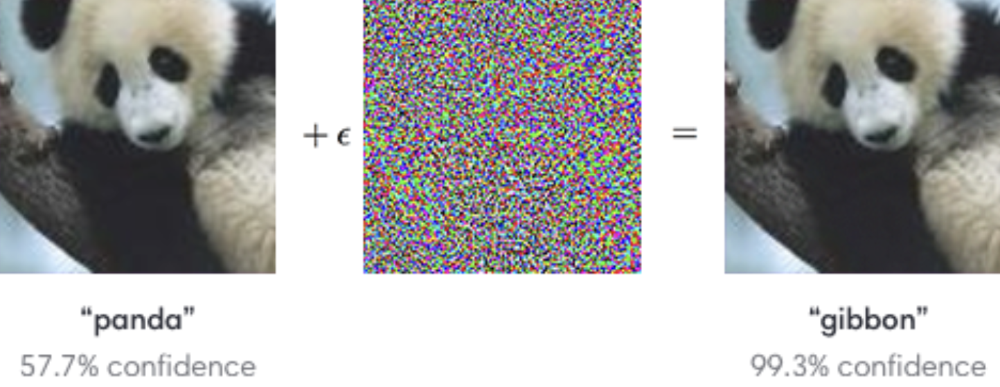

# Adversarial Examples Repository

This repository dedicated to exploring adversarial examples using the ResNet18v1 computer vision classification model. 

> "An adversarial example is an instance with small, intentional feature perturbations that cause a machine learning model to make a false prediction." - [Interpretable Machine Learning](https://christophm.github.io/interpretable-ml-book/adversarial.html)


### Original Objective
The primary objective was to craft a function capable of taking any given image along with a specified target class and generating a modified version of the image. This modified image, infused with adversarial noise, would be misclassified by the model as the chosen target class, despite the content of the original image. Importantly, the modifications to the original image should remain imperceptible to the human eye.



### Repository Contents
The repository features two main notebooks:
- `notebooks/00_adv_noise_exp_sandbox.ipynb`: This is a sandbox for various experimental approaches, including a noteworthy experiment with Patch-based attacks and GradCAM, which visualizes the significance of image features. For insights into this technique, refer to the notebook's end.
- `notebooks/01_adv_noise_cleanup.ipynb`: This notebook showcases the creation of counterfactual examples that successfully trick the model into misclassifying images to a user-specified class. This method was validated using a subset of 50 images from the original ImageNet dataset, with all instances successfully deceiving the model.
- `notebooks/02_fixed_01_adv_noise_cleanup.ipynb`: Fixed adversarial example fitting. The primary correction involved removing the clamp from the fitting image process, which was producing artifacts and preventing the images from being denormalized.

### Environment Setup Instructions

To begin experimenting with adversarial examples, set up your environment by following these steps:

1. Create a new conda environment:
   ```bash
   conda create --name advexamples python=3.11
   ```

2. Activate the environment:
   ```bash
   conda activate advexamples
   ```

3. Install the necessary dependencies:
   ```bash
   pip install -r requirements.txt
   ```

4. Start Jupyter Lab to access the notebooks:
   ```bash
   jupyter lab --no-browser --ip 0.0.0.0 --port 8888 --allow-root --notebook-dir=.
   ```

### Literature Review and Methods

The development of this repository was informed by a comprehensive review of literature and various methods in the field of adversarial machine learning. Below are key resources and methods that have inspired and guided our experiments:

#### Literature:
- [Interpretable Machine Learning - Adversarial Examples](https://christophm.github.io/interpretable-ml-book/adversarial.html)
- [Interpretable Machine Learning - Counterfactual Explanations](https://christophm.github.io/interpretable-ml-book/counterfactual.html#counterfactual)
- [A Guide to Adversarial Attacks](https://jonathan-hui.medium.com/adversarial-attacks-b58318bb497b)

#### Possible Methods:
- Szegedy et al. (2013) “Intriguing Properties of Neural Networks” - An iterative white box approach using gradient descent to fit epsilon perturbations.
- Goodfellow et al. (2014) “Explaining and harnessing adversarial examples” introduced the “Fast Gradient Sign Method (FGSM)” - a one-pass method detailed in [A Deep Dive into the Fast Gradient Sign Method](https://medium.com/@zachariaharungeorge/a-deep-dive-into-the-fast-gradient-sign-method-611826e34865). Additional resources:
  - [Adversarial-Attacks GitHub Repository](https://github.com/AmineDiro/Adversarial-Attacks?tab=readme-ov-file)
  - [Adversarial Examples PyTorch GitHub Repository](https://github.com/sarathknv/adversarial-examples-pytorch/tree/master)
  - [PyTorch FGSM Tutorial](https://pytorch.org/tutorials/beginner/fgsm_tutorial.html)
- Athalye et al. (2017) propose the “Expectation Over Transformation (EOT)” method, which incorporates augmentation.
- Su et al. (2019) “The 1-pixel attack” utilizes differential evolution to modify images.
- Brown et al. (2017) “Adversarial Patch” - A particularly interesting method that explores whether an adversarial patch, such as an anime girl, could encapsulate a class like a rifle and be placed on an image to mislead the model.